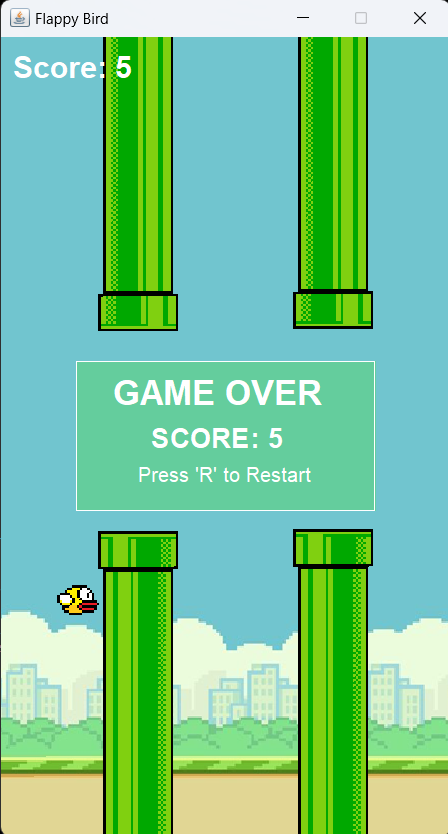
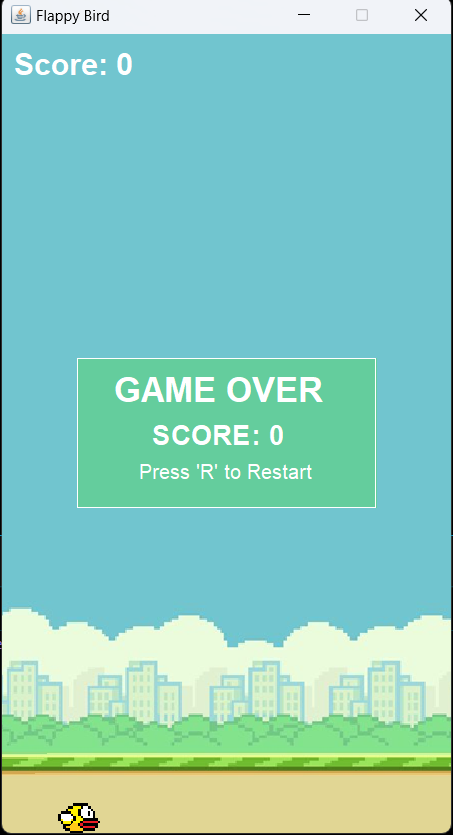

## Janji

Saya Lyan Nazhabil Dzuquwwa dengan NIM 2308428 mengerjakan Tugas Praktikum 6 dalam mata kuliah Desain dan Pemrograman Berorientasi Objek untuk keberkahanNya maka saya tidak melakukan kecurangan seperti yang telah dispesifikasikan. Aamiin.

## Desain Program
Program terdiri dari beberapa class utama:
1. **App** - Class utama yang menjalankan aplikasi dan menginisialisasi frame
2. **StartMenu** - Menampilkan menu awal dengan tombol start
3. **FlappyBird** - Class utama yang mengimplementasikan game dan logika permainan
4. **GameOverPanel** - Inner class untuk menampilkan panel ketika game berakhir

Program menggunakan Java Swing untuk implementasi antarmuka grafis dan memiliki fitur-fitur berikut:
- Menu awal dengan tombol Start Game
- Background game dengan scrolling
- Obstacle berupa pipa yang harus dihindari
- Sistem scoring
- Panel Game Over yang menampilkan skor dan opsi restart

## Alur Program
1. Saat program dijalankan, akan muncul menu awal dengan judul "FLAPPY BIRD" dan tombol "Start Game"
2. Ketika tombol "Start Game" ditekan, permainan akan dimulai
3. Pemain dapat menggunakan tombol SPACE untuk membuat karakter burung melompat ke atas
4. Pemain harus menghindari pipa-pipa yang muncul dari kanan layar
5. Setiap berhasil melewati sepasang pipa, skor akan bertambah
6. Jika pemain menabrak pipa atau jatuh ke bawah layar, permainan berakhir
7. Panel Game Over akan ditampilkan dengan skor akhir dan instruksi untuk restart
8. Pemain dapat menekan tombol 'R' untuk memulai permainan baru

## Dokumentasi

